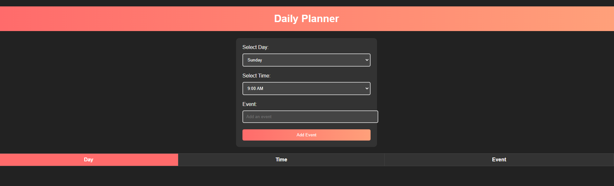

# Work-Day-Scheduler# Daily Planner Web Application

**Daily Planner** is a simple web application that helps you organize and plan your daily schedule. It allows you to select a day, time, and add events, which are displayed in a table format. This README provides an overview of the application's structure and functionality.

## Table of Contents

- [Features](#features)
- [Usage](#usage)
- [License](#license)

## Features

- **Day and Time Selection**: Choose a specific day of the week and time for your event.
- **Event Addition**: Easily add events with a descriptive name.
- **Event Display**: View your scheduled events in a table format.
- **User-Friendly**: Intuitive and user-friendly interface for managing your daily schedule.

## Usage
Using the Daily Planner is straightforward:

- **Select a Day and Time**: Choose the desired day of the week from the "Select Day" dropdown and the preferred time from the "Select Time" dropdown.

- **Add an Event**: Type the name or description of your event in the "Event" input field.

- **Add the Event**: Click the "Add Event" button to add the event to your daily schedule.

- **View Your Events**: Your added events will be displayed in the table, showing the day, time, and event description.

##  License
N/A